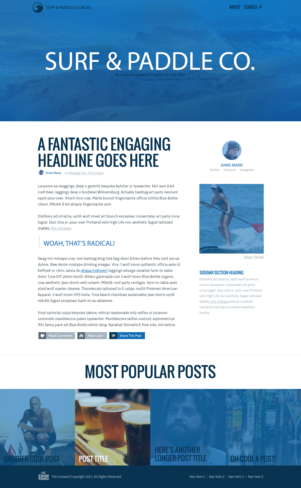

# Week 3 Lab: Surf and Paddle

## Description
As a developer on the web, you will sometimes be tasked with creating an html page simply from an image file.  In this assignment, you&#x27;ll be taking an image and turning it into a functioning website.

## Objectives

### Learning Objectives

Upon completion of this assignment, you should:

* Understand the proper use and function of html tags.
* Understand and able to leverage the many css properties to style content.
* Use CSS to create layout for the HTML page.

### Performance Objectives

After completing this assignment, you be able to effectively use

* Master HTML tags
* Effectively utilize some common css layout strategies (float or inline-block)
* Demonstrate static web site creation

## Details

### Deliverables

* A Middleman repo containing at least:
  * `index.html`
  * 'styles.css'
  * 'images/'

### Requirements

* The resulting web page cannot just be an image of the assignment centered on the page :)
* Use Middleman, and middleman's asset pipeline 
* Deploy Middleman site to GitHub pages
* Do not use Bootstrap or another UI Framework.

## Normal Mode

Using the image located `assets/surf-and-paddle.png`, create a middleman project and while using html and css to look like below, but be a function website:

## Hard Mode

Complete Normal Mode then make the website fully responsive and adhering to this [responsive wireframe](assets/surf-and-paddle-responsive.pdf).

## Additional Resources

* Explore Codepen on [Cover](http://codepen.io/jwo/pen/GJqeRo)
* Explore Codepen on [Hover](http://codepen.io/jwo/pen/EjyrMe)
* Explore Codepen on [Tint/Overlay](http://codepen.io/jwo/pen/XbKGWP)
* Read [Learn Layout](http://learnlayout.com/)
* Read [HTML tag content categories](https://developer.mozilla.org/en-US/docs/Web/Guide/HTML/Content_categories)
